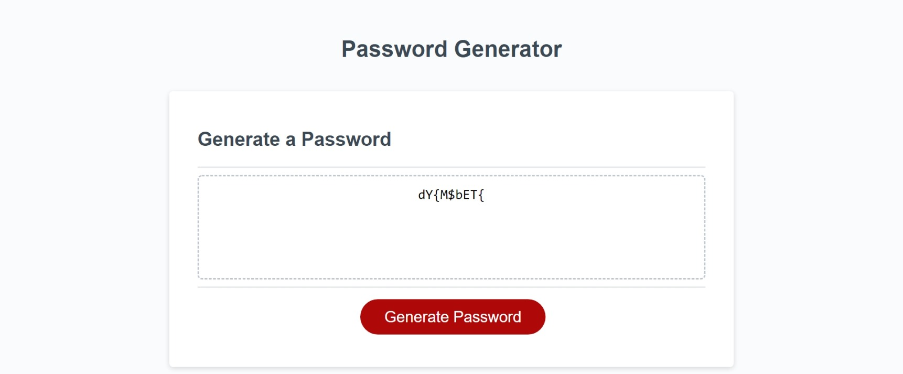

# password-generator# 03 JavaScript: Password Generator

## Your Task

This week’s homework requires you to modify starter code to create an application that enables employees to generate random passwords based on criteria that they’ve selected. This app will run in the browser and will feature dynamically updated HTML and CSS powered by JavaScript code that you write. It will have a clean and polished, responsive user interface that adapts to multiple screen sizes.

The password can include special characters. If you’re unfamiliar with these, see this [list of password special characters](https://www.owasp.org/index.php/Password_special_characters) from the OWASP Foundation.

## Mock-Up

The following image shows the web application's appearance and functionality:

### Deployment: 

* Application deployed at live URL.

[Click here to go to deployed application.](https://behnoosh93.github.io/password-generator/. )

* Application GitHub URL submitted.

[Click here to go to deployed application.](https://github.com/Behnoosh93/password-generator)
